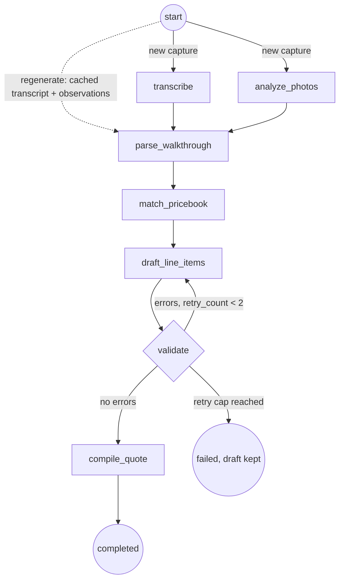

# QuoteLens

AI quoting for trades. Walk a job site, photograph the work area, record a
spoken walkthrough, and an agent pipeline returns an itemized, evidence-cited
estimate before you leave the driveway. Every line item cites a photo the vision
model actually analyzed, every price comes from a seeded price book (never
invented), and the quote streams into the review screen line by line as the
pipeline emits it.

Portfolio project by Shery Labs. Source is public; the app is demonstrated on
video and through one live hosted web quote. It is not distributed through an
app store. See [Scope and honesty](#scope-and-honesty).

**Live web sample:** https://quotelens-ten.vercel.app/q/sample-water-damaged-bedroom
&nbsp;(a real quote rendered server-side from hosted Supabase, no login)

<!-- Demo GIF is added after the video is recorded (see docs/DEMO_RUNBOOK.md). -->


---

## What it does

1. **Sign in** with a passwordless 6-digit email code.
2. **Create a job** (client, trade / price book) and drop into a walk-and-talk
   capture: one continuous audio recording runs while you snap photos, each
   uploading eagerly to private storage.
3. **Generate.** The backend transcribes the audio, runs vision on each photo,
   extracts tasks from the narration, matches them to the price book, drafts
   line items, and validates them.
4. **Watch it assemble live.** Line items slide into the review screen as the
   pipeline drafts them, each with its photo thumbnail attaching and the running
   total ticking up. If validation fails, the drafted rows visibly retract and
   the corrected items stream in fresh.
5. **Edit and send.** Adjust quantities and prices inline; edits sync across
   devices in under two seconds. Send opens the native share sheet with a public
   quote link.
6. **The client accepts.** The share link renders the quote in any browser with
   no login; the Accept action persists and an Accepted banner syncs back into
   the app.

## Architecture

Monorepo, one commit history, one verification gate.

| Package | Stack | Role |
|---|---|---|
| `mobile/` | Expo SDK 57, React Native 0.86, TypeScript strict, expo-router | Capture, live-assembly review, editing, trace viewer |
| `web/` | Next.js 16 App Router, React 19 | Public client quote page and Accept action |
| `backend/` | FastAPI, LangGraph, Python 3.12 (uv) | The seven-node agent pipeline |
| `supabase/` | Postgres 17, Storage, Realtime, Auth | Data, media, realtime transport, auth (RLS on every table) |
| `schema/` | JSON Schema artifact | Single source of truth for the Pydantic and Zod mirrors |

**Data flow.** Photos and audio upload directly from the phone to a private
Supabase Storage bucket under row-level-security-scoped paths. The mobile app
sends its Supabase JWT to FastAPI, which verifies the signature against the
project JWKS and acts through the service role with every query scoped to the
verified user. The backend never proxies large media. Realtime rides Supabase
`postgres_changes` on two tables: `quote_events` (live assembly) and
`quote_line_items` (cross-device edit sync), so a second device updates without
FastAPI in the loop.

## The seven-node pipeline

`transcribe` and `analyze_photos` fan out in parallel from the entry point and
join at `parse_walkthrough`. Validation failures loop back to `draft_line_items`
with a hardcoded cap. On regenerate, the entry router skips straight to
`parse_walkthrough` using the cached transcript and observations, so a
regenerate never re-pays transcription or vision.



| Node | Model | Output |
|---|---|---|
| `transcribe` | faster-whisper (in-process, int8) | narration transcript |
| `analyze_photos` | Claude Sonnet vision (one call per photo) | per-photo observations tagged with photo IDs |
| `parse_walkthrough` | Claude Haiku | tasks extracted from the transcript |
| `match_pricebook` | Claude Haiku | an existing price-book item ID or null per task |
| `draft_line_items` | Claude Haiku | line items with quantities, prices, citations |
| `validate` | pure code, no LLM | schema + citation cross-check; fires the retry edge |
| `compile_quote` | pure code, no LLM | the final quote, re-validated |

Every node writes an `agent_traces` row (input, output, duration, token counts),
which drives both the review screen's stage ticker and the trace viewer.

## Hard invariants

These are the lines the project is built to defend, enforced mechanically rather
than by prompt.

- **Mandatory photo citations.** `QuoteLineItem.photo_citations` is non-empty by
  schema constraint (`backend/app/pipeline/schemas.py`), and `validate`
  cross-checks every cited photo ID against the set `analyze_photos` actually
  observed (`backend/app/pipeline/nodes/validate.py`). A line with an empty or
  unknown citation fails validation and never reaches the UI.
- **No invented prices.** `match_pricebook` is schema-constrained to an existing
  item ID or null; any ID not in the book is dropped to null
  (`backend/app/pipeline/nodes/match_pricebook.py`). Unmatched work renders as
  `unpriced` ("To be quoted"), never a guessed number.
- **Bounded self-correction.** The retry edge loops `validate` back to
  `draft_line_items` with `retry_count < 2` hardcoded
  (`backend/app/pipeline/nodes/validate.py`). Cap exhaustion leaves the quote
  `failed` with the last draft preserved and a Regenerate action available.
- **RLS everywhere.** Row-level security is enabled on all nine tables
  (`supabase/migrations/`), and the service-role backend scopes every query by
  the verified user and asserts parent-row ownership on the paths where RLS is
  bypassed.
- **Live assembly from real events.** The animation is driven by real pipeline
  events persisted to `quote_events`, not a staged replay over a finished quote.
  The trace timeline aligns with what the UI showed, including the retry
  retraction.

## Data model

Nine tables, RLS on every one: `profiles`, `price_books`, `price_book_items`,
`jobs`, `captures`, `quotes`, `quote_line_items`, `quote_events`,
`agent_traces`. `quote_events`, `quote_line_items`, `quotes`, and `agent_traces`
are in the Supabase realtime publication. The quote schema is a committed JSON
Schema artifact (`schema/quote.schema.json`) generated from the Pydantic models;
a backend test fails on drift and a mobile test asserts the Zod mirror matches it
field for field.

## Running it locally

**Prerequisites:** Node with `pnpm`, Python 3.12 with `uv`, a Supabase project,
an Anthropic API key.

```bash
# 1. Install JS workspaces from the repo root (.npmrc pins node-linker=hoisted).
pnpm install

# 2. Configure env: copy the template and fill in your values.
cp .env.example .env      # see the file for every variable and what reads it

# 3. Backend (FastAPI + pipeline).
set -a && source .env && set +a
cd backend && uv sync
uv run uvicorn app.main:app --port 8000        # add --host 0.0.0.0 for a LAN device

# 4. Mobile (Expo).
cd mobile && pnpm expo start                    # scan the QR in Expo Go

# 5. Web (public quote page).
cd web && pnpm dev
```

The database schema and seed data live in `supabase/migrations/` (apply with the
Supabase CLI). Email sign-in needs custom SMTP configured on the project
(`backend/scripts/configure_email_smtp.py`); without it, mint a code with
`backend/scripts/mint_login_code.py`. To render a stable public sample quote for
the web page, run `backend/scripts/seed_web_sample.py`.

### Verification

```bash
bash .claude/verify.sh          # backend pytest, mobile tsc, eslint, jest
pnpm -C web typecheck           # web type check
cd web && set -a && source ../.env && set +a && pnpm test:e2e   # web Playwright E2E
```

The backend tests cover the hard invariants directly: an uncited line item is
rejected, a citation naming an unobserved photo is rejected, the retry edge
fires on a seeded invalid draft and succeeds on the second pass, the cap halts
at two with the draft preserved, regenerate reuses the cached transcript and
observations, and the Pydantic schema regenerates byte-identical to the
committed artifact.

For the demo walkthrough (physical iPhone against the Mac-LAN backend, including
the retry retraction and the cross-device edit), see
[`docs/DEMO_RUNBOOK.md`](docs/DEMO_RUNBOOK.md).

## Limitations

Each with its upgrade path.

- **Fire-and-forget generation.** The app subscribes to realtime after triggering
  generation; there is no background job queue. Upgrade path: a durable worker
  (for example Celery or a Supabase queue) for retries and horizontal scale.
- **No payments.** Accept records agreement only. Upgrade path: a Stripe deposit
  flow off the accepted event.
- **No offline capture.** A session requires connectivity. Upgrade path: a local
  capture queue that drains when the connection returns.
- **Seeded price books, no learning.** Prices come from seeded books and the app
  never invents one. Upgrade path: per-account price-book editing and import.
- **Backend runs locally, not hosted.** The demo runs FastAPI on the Mac LAN; only
  the web quote page is hosted (Vercel), reading hosted Supabase directly. Upgrade
  path: containerize and deploy the API (for example Railway or Render) with
  managed transcription.
- **Android is the same Expo code but demoed on iOS.** No platform-forked screens;
  the demo is recorded on a physical iPhone. Upgrade path: an Android device pass
  and a Play listing if distribution is ever pursued.
- **Transcription is demo-grade.** faster-whisper `small` locally; a deployed free
  tier would use `base`. Upgrade path: managed transcription for production.
- **Light theme only.** Single palette. Upgrade path: a dark palette off the
  existing token module.

## Scope and honesty

QuoteLens ships as a portfolio package: this public repository, a recorded demo
video, and one live hosted web quote sample. It is deliberately not distributed
through the Apple App Store or Google Play. The backend runs locally for the
demo; the client quote page is the only hosted surface. There are no paying
users and no client traction claimed. That is the claim in full: source public,
demonstrated on video, one live web sample.

## License

Portfolio project by Shery Labs.
